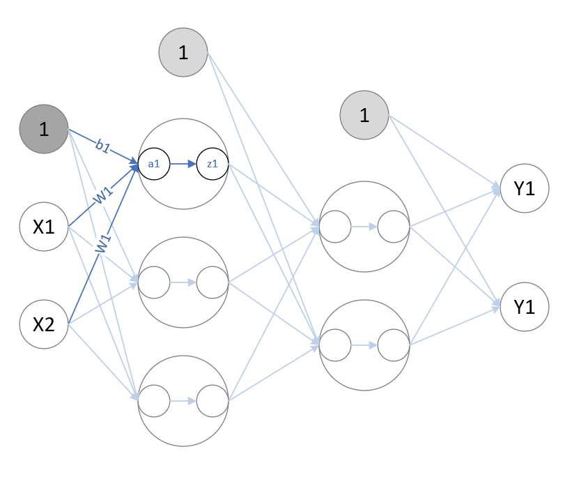

# 深度学习入门

---

## 1. demo01：神经网络基础

1. **NumPyTest:** NumPy 数组基础
2. **MatplotlibTest:** 图形绘制基础
3. **ActivationFunction:** 激活函数
4. **InitNetWork:** 一个简单的三层神经网络，课本56，3.4小节。
4. **OutputFunction:** 输出函数




### 输出层的设计

神经网络可以用在分类问题和回归问题上，根据需要改变输出层的激活函数。一般而言，回归问题用恒等函数，分类问题用 **softmax** 函数。

分类问题即数据属于哪一个类别的问题；回归问题是根据某个输入预测一个数值的问题。

输出层的神经元数量需要根据实际问题进行确定。对于分类问题，输出层的神经元数量一般设定为类别的数量。对于输出值，取其中的最大值对应的类别为最终的输出结果。

#### 1. 恒等函数

将输入原样输出。

#### 2. softmax 函数

函数式：
$$
y_k = \frac{exp(a_k)} {\sum_{i=1}^{n}{exp(a_i)}}
$$
假设输出层一共有 $n$ 个输出，计算第 $k$ 个神经元的输出 $y_k$，分子是输入信号 $a_k$ 的指数函数，分母是所有输入信号的指数函数的和。

使用 softmax 函数在计算时，容易产生 **溢出**，使得数据的计算难以正常运行，为此，对 softmax 进行改进。改进后的函数式如下：
$$
y_k = \frac{exp(a_k - max\{a_i\})} {\sum_{i=1}^{n}{exp(a_i- max\{a_i\}))}}
$$
**注意:** 

- $max\{a_i\}$ 即输入信号中的最大值。
- softmax 函数的输出总是 0.0 ~ 1.0 的实数，且所有输出值的总和为 **1**。为此，也将 softmax 函数的输出值称为 **概率**。
- softmax 函数不改变各个元素之间的大小关系。

---


## 2. demo02：手写数字识别

1. **mnist.py：**下载 MNIST手写数字图像集，输出成为 **mnist.pkl** 文件。 MNIST手写数字图像集，由 0 - 9 的数字图像构成。每个图像是 28像素 * 28像素的灰度图像，各个像素的取值在 0 - 255 之间。每个图像都有相应的标签表明图像中的数字。
2. **load_mnist()：**mnist.py 中的方法，读取 mnist.pkl 文件，将之以 **(训练图像，训练标签), (测试图像，测试标签)** 的形式返回。**load_mnist()** 有三个布尔型参数：
   - **normalize：**是否将输入图像的各个像素点的值正规化为0.0 ~ 1.0 的值（即将各个像素点的值除以255）。
   - **flatten：**是否将输入图像的各个像素点保存为一位数组。若为False，则输入图像为 $1*28*28$ 的三维数组。
   - **one_hot_label：**是否将标签保存为 **one-hot** 表示。**one-hot** 是仅正确解标签为 1，其余为 0 的数组，例如 **[0,0,1,0,0,0,0,0,0,0]**。否则，只是像 7，2 这样简单的保存正确解标签。
3. **showImg：**显示训练集中的第一张图像。
4. **neuralnet_mnist.py：**简易三层神经网络，对输入的图像进行预测。


### 批处理

批处理，每次处理一批数据。

从矩阵的角度来看，

神经网络每次的输入信号原本是单个的行向量；输出信号也是单个的行向量。

进行批处理，则每次的输入信号为多个行向量构成的二维数组，一行为一个输入；输出信号也是多个行向量构成二维数组，一行为一个输出。

```python
def predict_batch():
    """
    批处理，每次处理一批数据
    """
    x, t = get_data()
    network = init_network()

    batch_size = 100  # 批数量
    accuracy_cnt = 0

    for i in range(0, len(x), batch_size):
        x_batch = x[i: i+batch_size]    # 列表的截取操作，一张图片为一行，共 100 行
        y_batch = predict(network, x_batch)
        p = np.argmax(y_batch, axis=1)    # axis=1，即行方向，取每行的最大值所在的索引。若axis=0，即列方向。
        accuracy_cnt += np.sum(p == t[i: i+batch_size])    # 比较 预测结果与实际结果，用 “==” 生成 True/False 构成的布尔型数组，计算其中 True 的数量。

    print("Accuracy:" + str(float(accuracy_cnt) / len(x)))
```

---


